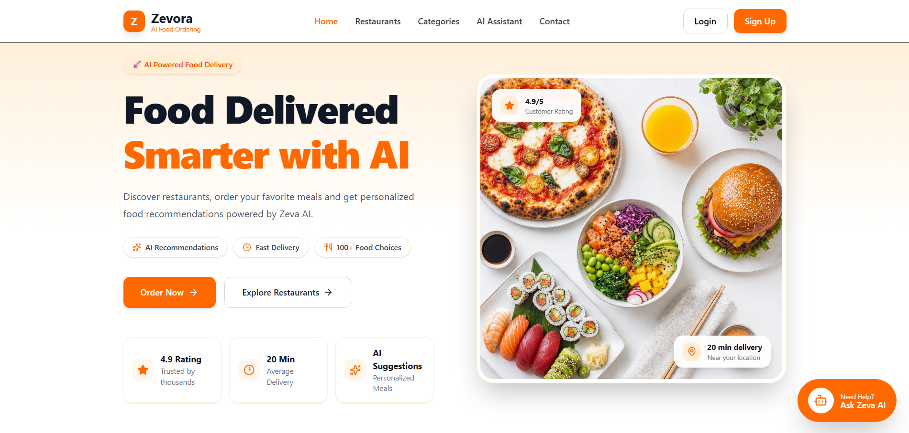
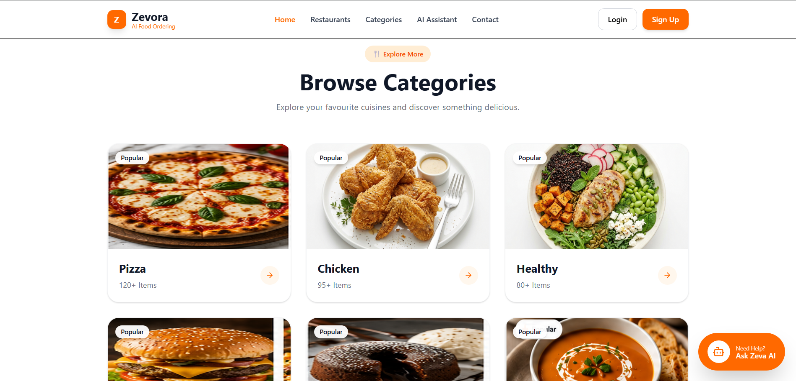
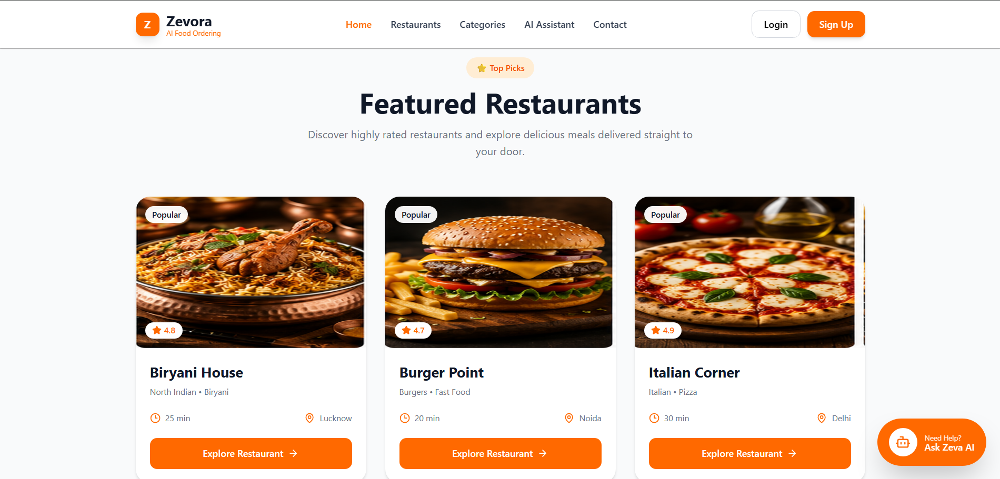
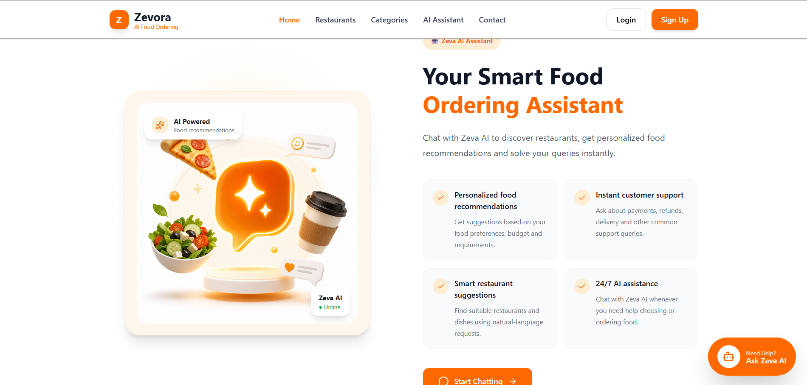
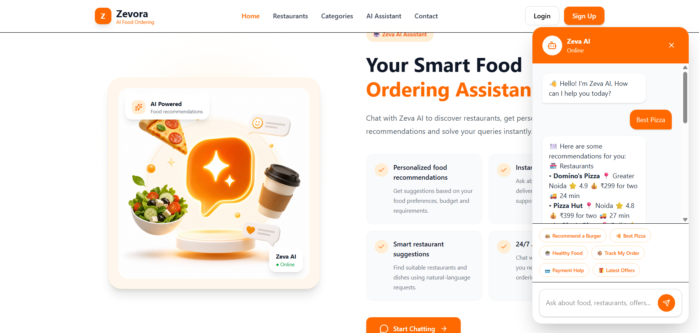

# Zevora AI – AI-Powered Food Ordering Assistant

<p align="center">
  <strong>
    An AI-powered food ordering assistant that helps users discover restaurants,
    explore dishes, get personalized recommendations, and resolve common
    food-ordering support queries.
  </strong>
</p>

<p align="center">
  <a href="https://zevora-ai-customer-support-chatbot.vercel.app/">
    Live Demo
  </a>
  &nbsp;•&nbsp;
  <a href="https://github.com/harshitsrivastava1232/zevora-ai-customer-support-chatbot">
    GitHub Repository
  </a>
</p>

---

## 🚀 Overview

Zevora AI is a full-stack AI-powered food ordering web application built
around an intelligent conversational assistant.

Users can search for food, restaurants, cuisines, and meal options using
natural-language requests and receive recommendations based on preferences
such as food category, budget, city, vegetarian/non-vegetarian requirements,
and meal type.

The application also provides customer-support responses for common queries
related to payments, refunds, coupons, delivery, and order tracking.

---

## ✨ Key Features

- 🤖 AI-powered conversational food assistant
- 🍕 Restaurant and dish recommendations
- 🔎 Natural-language food search
- 💰 Budget-based food filtering
- 🥗 Healthy food recommendations
- 🌱 Vegetarian and non-vegetarian filtering
- 📍 City-based restaurant search
- 🍽️ Breakfast, lunch, and dinner recommendations
- ⭐ Rating-based restaurant ranking
- 🚚 Delivery-time information
- 💳 Payment and refund assistance
- 🎁 Offers and coupon support
- 📦 Order tracking assistance
- 💬 Conversational follow-up support
- 📱 Responsive web interface
- ☁️ Cloud deployment with Vercel and Render

---

## 🧠 AI Capabilities

Zevora AI understands natural-language food requests such as:

```text
Show me pizza
Pizza under ₹300
Best burger
Healthy dinner
Restaurants in Greater Noida
Only veg pizza
Suggest spicy chicken
High protein food

The assistant can also handle follow-up conversations such as:

User: Pizza


User: Under ₹300


User: Which one is the best?


User: Why?

This allows users to interact with the system conversationally instead of
having to provide all requirements in a single query.

🛠️ Tech Stack

Frontend
React.js
Vite
JavaScript
Tailwind CSS
Axios
React Markdown
Lucide React
Backend
Node.js
Express.js
JavaScript
REST APIs
Database
MongoDB
MongoDB Atlas
AI
Google Gemini API
Deployment & Version Control
Vercel – Frontend deployment
Render – Backend deployment
GitHub – Source control and automatic deployment

🏗️ System Architecture
                         ┌───────────────────────┐
                         │         User          │
                         │   Desktop / Mobile    │
                         └───────────┬───────────┘
                                     │
                                     ▼
                         ┌───────────────────────┐
                         │   Vercel Frontend     │
                         │   React + Vite + UI   │
                         └───────────┬───────────┘
                                     │
                                  REST API
                                     │
                                     ▼
                         ┌───────────────────────┐
                         │    Render Backend     │
                         │ Node.js + Express.js  │
                         └──────────┬─────┬──────┘
                                    │     │
                      ┌─────────────┘     └──────────────┐
                      ▼                                  ▼
          ┌──────────────────────┐           ┌──────────────────────┐
          │    MongoDB Atlas     │           │      Gemini API      │
          │ Restaurants / Dishes │           │ Conversational AI    │
          │ FAQ / Application    │           │ AI Responses         │
          └──────────────────────┘           └──────────────────────┘
📂 Project Structure

zevora-ai-customer-support-chatbot/
│
├── backend/
│   ├── config/
│   ├── controllers/
│   ├── models/
│   ├── routes/
│   ├── seed/
│   ├── services/
│   ├── .env
│   ├── package.json
│   └── server.js
│
├── public/
│   ├── images/
│   └── ...
│
├── src/
│   ├── components/
│   │   ├── chatbot/
│   │   ├── home/
│   │   ├── layout/
│   │   └── ui/
│   ├── pages/
│   ├── App.jsx
│   ├── index.css
│   └── main.jsx
│
├── .env
├── .gitignore
├── index.html
├── package.json
├── vite.config.js
└── README.md
🔌 API
Chat API
POST /api/chat

Example request:

{
  "message": "pizza under 300"
}

The API uses a session identifier to maintain conversational context.

⚙️ Local Setup

1. Clone the repository
git clone https://github.com/harshitsrivastava1232/zevora-ai-customer-support-chatbot.git
cd zevora-ai-customer-support-chatbot
2. Install frontend dependencies
npm install
3. Install backend dependencies
cd backend
npm install
cd ..
4. Configure environment variables

Create a .env file in the project root:

VITE_API_URL=http://localhost:5000

Create another .env file inside the backend folder:

PORT=5000
MONGODB_URI=your_mongodb_atlas_connection_string
GEMINI_API_KEY=your_gemini_api_key

Never commit .env files, API keys, database credentials, or other
sensitive values to GitHub.

5. Start the backend

Open a terminal and run:

cd backend
npm run dev

The backend runs on:

http://localhost:5000
6. Start the frontend

Open another terminal from the project root:

npm run dev

The frontend normally runs on:

http://localhost:5173

🌐 Live Deployment

Frontend

https://zevora-ai-customer-support-chatbot.vercel.app/

Backend

https://zevora-ai-customer-support-chatbot.onrender.com

Database

MongoDB Atlas

🔐 Environment Variables

Frontend
VITE_API_URL
Backend
PORT
MONGODB_URI
GEMINI_API_KEY

Sensitive credentials are stored through environment variables and are not
included in the source repository.

## 📸 Screenshots

### 🏠 Homepage



### 🍽️ Browse Categories



### 🏪 Featured Restaurants



### 🤖 Zeva AI Assistant



### 💬 AI Chatbot



💡 Example Queries
Best burger
Pizza under ₹300
Healthy dinner
Restaurants in Greater Noida
Only veg pizza
High protein food
Track my order
Latest offers

🎯 Project Goals

Zevora AI was developed to demonstrate how conversational AI can be
integrated into a modern full-stack food ordering platform.

The project focuses on:

Intelligent food discovery
Personalized recommendations
Natural-language search
Conversational customer support
Cloud-based full-stack deployment
AI-assisted user experience

🔮 Future Improvements
User authentication and profiles
Restaurant detail pages
Functional cart and checkout
Real order management
Real-time order tracking
Persistent cloud conversation history
Advanced recommendation ranking
Payment gateway integration
Admin dashboard
Custom domain

👨‍💻 Author

Harshit Srivastava

B.Tech Computer Science Engineering

GitHub:
https://github.com/harshitsrivastava1232

LinkedIn:
https://www.linkedin.com/in/harshit-srivastava123

📄 License

This project is intended for educational, portfolio, and demonstration
purposes.